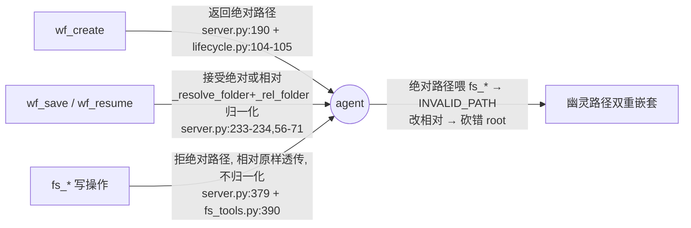

# work-folder MCP fs_* path 契约统一与写侧 folder 归属校验

## 0. TL;DR

- **数据归属 MCP、agent 不直接碰本地 FS** 这两条底线**已满足**，治理内核（git 后端 + ResourceIdLedger/tombstone + CAS + policy invariants + TransactionManifest）扎实。
- 双重嵌套 bug 的根因**不是「物理解耦失败」**，而是 `fs_*` 的 **path 契约不一致 + 写侧无 by-id + `_check_path` 无 folder 归属校验**，三者叠加让 agent 推导出错位 path，MCP 在错误位置忠实落盘。
- **这是正确性 bug，不是解耦性缺口。** 修复范围收窄：把已有的 id 体系贯穿到写侧 + 给 path 加 folder 归属校验 + 统一契约，**不重写虚拟层**。

## 1. 背景

2026-07-15 KB MCP 统一数据层 cutover 当天，首个经 `fs_*` 写入的新 work folder
`2026/07/15/claude-code-web-frontend-brainstorm-…` 发生物理分裂：

| 物理位置 | 文件数 | 内容 |
|---|---|---|
| 规范路径 `…/工作记录/2026/07/15/<slug>/` | 3 | 空壳（wf_create seed，13:49 后未更新） |
| 幽灵路径 `…/工作记录/智元工作/工作记录/2026/07/15/<slug>/` | 12 + references/ | 全部真实产出（design.md / plan.md 58KB / findings.md / 两份核实清单） |

历史 786 个 folder 在规范路径、未受影响；嵌套幽灵路径仅此 1 个——即 cutover 后首个走 `fs_*` 的新 folder。

触发 session 调用序列（c5be031d）还原出的 agent 行为：

```
wf_create()        → 返回 /data/work-records/智元工作/工作记录/2026/07/15/<slug>  (绝对路径)
fs_write(goal.md)  → 喂同款绝对路径 → INVALID_PATH("must not contain '..' or absolute paths")
fs_write #2        → agent 改相对路径，误把 /data/work-records 当 root，砍掉它：
                     智元工作/工作记录/2026/07/15/<slug>/goal.md
                     ↑ 真 root 是 /data/work-records/智元工作/工作记录 → 多出的段变成相对路径
139×fs_create + 56×fs_write + 3×wf_save → 全部落到幽灵路径
```

## 2. 白盒坐实

### 2.1 治理内核现状（比预期扎实，先正名）

`fs_tools.py` 不是薄物理透传网关：

| 能力 | 实现 | 源码 |
|---|---|---|
| 版本化后端 | git repo，每次 mutate 带 commit，失败 `_restore_tree` 回滚 | `server.py:134,137` / `fs_tools.py:1485` |
| Resource ledger + tombstone | `wf-xxxxxx` id，删除即 tombstone，防 id 复用 | `server.py:138` / `fs_tools.py:36,317` |
| CAS 乐观并发 | `expected_base_sha` / `expected_resource_revision` + `CASRejectionError` | `fs_tools.py:1472` |
| Policy invariants | append-only changelog、BROKEN 块守恒、completed folder 不可变、id 不可变、critical file 保护 | `fs_tools.py:399-515` |
| Transaction manifest | 每次 mutate 记 `changed_paths` + `idempotency_key` | `server.py:142` |

所有写经 `GovernedKernel.mutate → binding.vfs.write`（`fs_tools.py:1449/1608/1785/1942/2131/2243`），物理后端由 MCP 进程独占，agent 无本地 FS 句柄——**结构上无法绕过 MCP 直接写本地文件**。

### 2.2 配置层：三个 root 其实是同一个

`configure()`（`server.py:126-146`）：

```python
_wf_root = work_folder_path                         # L129
vfs = GovernedVFS(work_folder_path)                 # L137  VFS root
_fs_tools = FSTools(_kernel, work_folder_path)      # L146  FSTools.repo_root
```

即 `_wf_root` == VFS root == `FSTools.repo_root` == `/data/work-records/智元工作/工作记录`。

### 2.3 根因三宗罪

**罪 1 — 三个工具家族，三套 path 契约：**



- `wf_create` 返回绝对路径：`lifecycle.py:104-105` `folder = os.path.join(work_folder_root, date_str, slug)` + `Path(folder).resolve()`，再经 `_patch_store_result`（`server.py:81-85`）兜底转绝对。
- `wf_save`/`wf_resume` 接受「绝对或相对」并归一化：`_resolve_folder`（`server.py:56-64`，绝对原样 / 相对 join `_wf_root`）+ `_rel_folder`（`server.py:67-71`，绝对 → `relpath` 到 `_wf_root`）。
- `fs_*` **拒绝对路径、相对路径原样透传、不归一化**：`server.py:379/393/409/450` 直接 `_fs_tools.fs_xxx(path, …)`；`fs_tools.py:390` `path.startswith("/")` 即拒。

**罪 2 — 写侧没有 by-id（读侧有）：**

`fs_resolve(path_or_id)`（`fs_tools.py:1106`）与内部 `_resolve_path`（`fs_tools.py:203-206`）支持 `wf-xxxxxx` id 寻址；但 `fs_create/fs_write/fs_edit/fs_copy/fs_rename/fs_delete` 签名全是 `path`（`fs_tools.py:1366/1508/1665/1846/2004/2186`），**写侧根本不开放 id 入口**。否则 agent 可直接用 `wf-bcba1d` 锚定 folder，不必推导物理路径。

**罪 3 — `_check_path` 不校验 folder 归属/布局（bug 直接入口）：**

`_check_path`（`fs_tools.py:389-397`）仅拒绝 `..` / 绝对 / `.` 开头 / `.git`·`.katana`。agent 给的错位相对路径 `智元工作/工作记录/2026/…` 全部通过，VFS 默默 `mkdir -p` 出双重嵌套。治理内核虽强，write 侧却**没有任何「path 必须属于某个已注册 folder / 必须符合 `YYYY/MM/DD` 布局」的约束**。

**附带：wf_save 也被带沟里** — session 里 `wf_save` 的 folder 参数是错位的相对路径，`_resolve_folder` 忠实 resolve 到幽灵路径，故幽灵路径下 progress/context 也是完整内容（实体在幽灵位、空壳在规范位的成因）。

## 3. SPEC

### 3.1 目标

消除双重嵌套根因；让 agent 无需推导/感知物理路径；不重写治理内核。

### 3.2 设计

#### D1. folder-id 贯穿写侧（核心）
所有 `fs_*` 写操作新增 `folder_id: str | None`：
- 给定 `folder_id` 时，复用 `_resolve_by_id`（`fs_tools.py:208`）解析 id → canonical folder path；`path` 解释为 **folder 内相对逻辑路径**（如 `design.md`、`references/foo.md`）。
- agent 从此无需知道 `_wf_root` / `YYYY/MM/DD` 布局。

#### D2. `_check_path` 升级：写侧 folder 归属校验
- path 不带 `folder_id` 时：经 `_resolve_folder` 归一化后，校验「落在某个已注册 folder 内」（用 `_scan_briefs` 的 folder 集合判定）。
- 落点不在任何已注册 folder 内 → `POLICY_VIOLATION: path not inside a registered work folder; use folder_id`，**而非默默 mkdir**。
- 直接堵死双重嵌套（错位的 `智元工作/工作记录/…` 不属于任何注册 folder，被拒）。

#### D3. 统一契约 + `wf_create` 脱敏
- **方案 A（推荐，彻底虚拟化）**：`wf_create` 返回 `{folder_id, logical_root}`，**不再返回物理绝对路径**；`fs_*`/`wf_save`/`wf_resume` 的 folder 参数接受 `folder_id`，物理路径成为 MCP 内部细节。
- **方案 B（过渡兼容）**：`fs_*` 像 `wf_save` 一样经 `_resolve_folder` 归一化（接受绝对）+ D2 归属校验。改动小，但仍向 agent 暴露物理路径。

#### D4. index 反幽灵校验
`_scan_briefs`（`fs_tools.py:241`）全盘 `**/_brief.md` 会追认幽灵路径。增强：scan 后校验每个 brief 物理路径「符合 `YYYY/MM/DD/<slug>` 且在 `_wf_root` 直接子树」，不符合则标 `location_anomaly` 告警，而非默默入 index。

#### D5. 错误信息可操作
`INVALID_PATH` 附带合法形态示例：`folder_id=wf-xxxxxx + folder 内相对路径（如 design.md）`，或「相对 work_folder_root 的 `YYYY/MM/DD/<slug>/…`」，并声明 root 边界不向 agent 暴露。

### 3.3 前置（一次性数据修复）
把幽灵 folder `git mv` 回规范路径，消除现存分裂——D4 告警会指出，D2 上线后新代码不会再产生。

### 3.4 验证（新增测试）
- `fs_write(folder_id="wf-bcba1d", path="design.md")` → 落规范位 ✓
- `fs_write(path="智元工作/工作记录/2026/…")` → `POLICY_VIOLATION` ✓
- `wf_create` 返回值不含物理绝对路径 ✓
- 回归：现有 `tests/test_composition.py::test_composition_vfs_rejects_absolute_path` 等继续过 ✓

### 3.5 影响面
- 改动集中在 `fs_tools.py`（写操作签名 + `_check_path` + D4 scan 校验）、`server.py`（`wf_create` 返回 + `fs_*` 透传层）。`lifecycle.py` 无需改。
- agent 侧：hook/prompt 引导改用 `folder_id`；兼容期内旧 path 带 deprecation warning。

## 4. 待决策
- D3 选 A 还是 B（彻底虚拟化 vs 过渡兼容）。→ **已定 A**
- 是否同步执行 3.3 数据修复（`git mv` 幽灵 folder）。→ **已执行**（work-records commit `d9df7844`）
- 实施走 worktree + PR（遵循「不直接 commit main」）。→ **已建** `feat/wf-fs-path-virtualization` @ `/data/code/self/worktrees/wf-fs-path-virt`

## 5. 实施纪要（2026-07-15）

| 项 | 状态 | 说明 |
|---|---|---|
| **D1** folder-id 贯穿写侧 | ✅ done | `fs_create/write/edit/copy/rename/delete` 全部新增 `folder_id` 参数；新增 `_resolve_folder_id_path` helper（id→canonical folder path + folder 内相对 path 拼接）。copy/rename 对 source、dest 双解析。server 层 6 个 fs_* 透传 folder_id。 |
| **D2** `_check_path` folder 归属校验 | ❌ **放弃** | 实施时发现：work-folder VFS 是**通用 md VFS**（不限 folder）——现有 `test_fs_create_non_brief_file` 合法地在 repo 根写孤立 `notes.md`。「path 必须落在注册 folder 内」与该语义冲突，会破坏合法用法。治本靠 D1（agent 用 folder_id，不推导物理路径），而非硬校验——无法可靠区分「合法子路径」与「错位嵌套」。故 §3.4 中「错位 path → POLICY_VIOLATION」的预期不成立（错位 path 仍是合法相对路径，不被拒；靠 folder_id 绕过）。 |
| **D3-A** wf_create 脱敏 | 🟡 部分 | wf_create **增返 `folder_id`**（保留 `path` 字段做向后兼容）。完整脱敏（移除 path 返回）涉及 agent prompt/hook 生态迁移，留后续 PR。 |
| **D4** index 反幽灵 scan | ⏸ deferred | `_scan_briefs` 物理布局校验留后续；数据修复已清除现存幽灵 folder。 |
| **D5** 错误信息可操作 | ✅ done | `_check_path` 绝对路径错误附带 `folder_id` 用法引导。 |

### 测试结果
- 新增 `tests/test_folder_id_addressing.py`：5 测试全绿（by-id create/write、id 未找到、免疫双重嵌套、兼容旧 path）。
- 现有测试 **412 pass / 0 回归**。
- 5 个 pre-existing failure（`test_fs_create_duplicate_path_rejected` 等，CAS/id 检查顺序 REF_MISMATCH vs BASE_COMMIT_CONFLICT）在 **main 未改动时即 fail**，非本 PR 引入，不在 scope。

### 后续工作（不在本 PR）
- D3 完整脱敏：移除 wf_create 的 path 返回 + agent 侧（SessionStart hook、CLAUDE.md、checkpoint skill）迁移到 folder_id。
- D4：`_scan_briefs` 反幽灵布局校验 + `location_anomaly` 告警。
- fs_batch 的 folder_id 透传（当前 6 个单/双 path 操作已支持，batch 内 op 的 folder_id 待加）。

# References
- 源码（cutover 运行版）：`/data/code/self/katana-cutover/mcp/work-folder/katana_work_folder_mcp/`
  - `fs_tools.py:36`（ID_RE）、`:203-215`（_resolve_path / _resolve_by_id）、`:241-267`（_scan_briefs）、`:389-397`（_check_path）、`:1106`（fs_resolve path_or_id）、`:1366/1508/1665/1846/2004/2186`（写操作 path 签名）、`:1449`（binding.vfs.write）
  - `server.py:56-85`（_resolve_folder / _rel_folder / _abs_path / _patch_store_result）、`:126-146`（configure：三 root 同一）、`:189-190`（wf_create 返回绝对）、`:233-234`（wf_save 归一化）、`:379/393/409/450`（fs_* 原样透传）
  - `lifecycle.py:104-105`（do_create join + resolve）
- 触发 session：`c5be031d-ef66-4956-bf5d-0865a9233f8d`（`-data-vault` project）
- 物理数据：`/data/work-records/`（规范路径 786 folder 完整；幽灵路径 1 folder 分裂）
