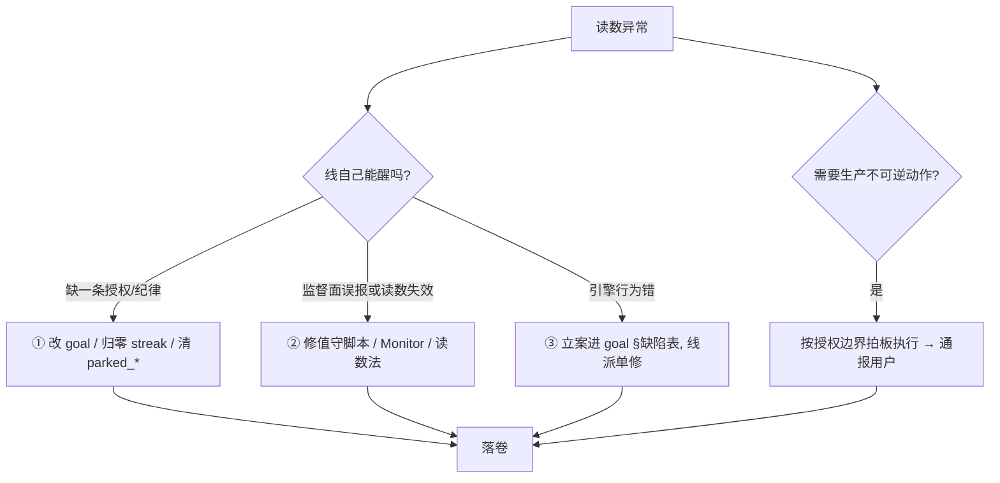

# 处置阶梯与判例

## 阶梯

原则：**能在下一层解决就不上一层**。①最便宜（goal 变更即唤醒，一次编辑）；②只动监督者自己的东西；③交给线，监督者不碰产品代码。

## 判例（2026-09-05 ronin-rebuild 值守二十小时）

| 现象 | 层 | 做法 | 结果 |
|---|---|---|---|
| 等 implement 时连续三轮 `continue + no_progress` 触发引擎熔断 blocked | ① | goal 补「机械驻停条」；后又收紧为「等待期最多一轮 A 类产物」 | 下一代第一轮即正确驻停 |
| worker report 自报 blocked，引擎落成 `waiting_on=none` 假阻塞 | ① | goal 补「驻停只能由 coordinator 信封出」 | 不再复发 |
| 单到 awaiting_gate，调度器因探针 fail-open 在 backoff 里睡 40–80 min | ①→② | 先手动归零 streak；第三次复发时把「awaiting_gate 超 20 min 且线不在跑 → 归零」写进 monitor 的 autowake | 止血自动化；根治归 R2 |
| Monitor 把健康的 dd 驻停当异常连报 | ② | 过滤 `blocked + waiting_on=dd`；旧终态按 run_id 判 stale | 静默 |
| Prometheus token 指标恒 0 | ② | 定位到 agent-runtime 采集缺陷（run_dir 指错 stamp 目录），改用直读 opencode.db | 花钱读数恢复 |
| dd 把「模型正常收尾但无结构化输出」贴成 PROVIDER_UNAVAILABLE | ③ | 取证到 `dd_actors.py` 行号，立案 X-4；线自己派单修并合流 | 当天闭环 |
| goal MCP `line_message` 必崩 | ③ | 立案 X-1 带根因行号；线派单修 | 合进线分支 |
| 被取代的前单仍在跑 implement，双份烧钱 | 生产不可逆 | `systemctl --user stop`，立案记录勿 adopt | 通报用户 |
| 别的 session 按入编 SOP 把执行位翻到 main，M 系列文件消失 | 生产面 | 取证谁 / 哪个 commit / 缺哪些文件；评估在跑单的 gate 路径；准备超集快照不翻转；通报用户并指出结构问题（main ≠ 生产引擎） | 待 gate 实证 |

## 边界判例（不该做的）

- 线把 gate 的 question 挂到看板，supervisor 审计标 `needs_human` —— **不投裁决**，等线自判；线没醒才去修唤醒。
- 看到 R 系列 spec 反复修订 —— 不替它写，改 goal 说明「spec 反复修订不是进展」。
- 引擎缺陷修起来很小 —— 仍然立案给线，不在监督面开 hotfix 分支（线是代码属主，合流路径也在线的分支上）。
